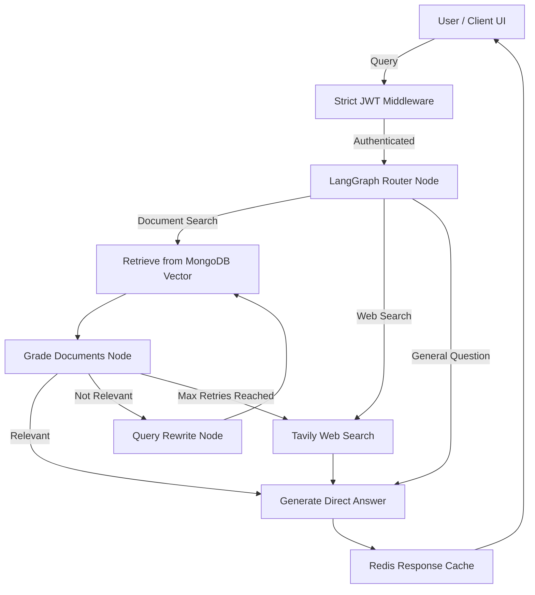

# RAG Autonomous Studio 🚀

A production-grade, enterprise-ready Retrieval-Augmented Generation (RAG) backend architecture powered by LangGraph, MongoDB Atlas, Redis, and BullMQ. This system implements an Autonomous AI Agent capable of document retrieval, web search, self-correction, and chat isolation.

## 🌟 Key Features

- **🧠 Autonomous LangGraph Agent**: Dynamically routes user queries to the best source (Documents, Web, or General Knowledge).
- **📑 Hybrid Vector Retrieval**: Combines MongoDB Atlas Vector Search with Cohere Reranking for pinpoint accuracy.
- **🌐 Real-time Web Search**: Integrates Tavily for live internet data when document context is insufficient.
- **🔁 Self-Reflection Loop**: Automatically evaluates retrieved chunks and rewrites its own queries if they fail relevance checks.
- **⚡ Async Task Queue**: Uses BullMQ + Redis for non-blocking background processing of heavy PDF uploads and embeddings.
- **🔒 Enterprise Security**: Strict JWT-based authentication preventing unauthorized API access and data leaks.
- **📂 Chat Isolation**: ChatGPT-style multi-tenant architecture where documents and chats are strictly scoped to specific user sessions.

## 🏗️ Architecture Flow



## 🛠️ Tech Stack

- **Runtime**: Node.js, Express.js
- **Database (NoSQL & Vector)**: MongoDB Atlas
- **Caching & Queues**: Redis Cloud, BullMQ
- **AI Framework**: LangChain, LangGraph
- **LLM Engine**: Google Gemini
- **Reranker**: Cohere
- **Web Search API**: Tavily

## 🚀 Getting Started

### 1. Clone the repository
```bash
git clone <your-repo-url>
cd RAG
```

### 2. Install Dependencies
```bash
npm install
```

### 3. Setup Environment Variables
Copy the example `.env` file and fill in your keys:
```bash
cp .env.example .env
```
Ensure you provide:
- `MONGO_URI`
- `REDIS_URL`
- `GEMINI_API_KEY`
- `JWT_SECRET`
- `COHERE_API_KEY` (Optional)
- `TAVILY_API_KEY` (Optional)

### 4. Run the Server
```bash
# For development (with hot-reload)
npm run dev

# For production
npm start
```

## 🔌 Core API Endpoints

| Endpoint | Method | Description |
|----------|--------|-------------|
| `/api/auth/signup` | POST | Register a new user |
| `/api/auth/login` | POST | Authenticate and receive JWT token |
| `/api/ingest` | POST | Upload a PDF document for vector ingestion |
| `/api/ingest/status/:jobId` | GET | Check progress of a background ingestion job |
| `/api/chat` | POST | Chat with the RAG agent |
| `/api/chat/sessions` | GET | Retrieve all past chat sessions for the user |
| `/api/chat/sessions/:sessionId` | GET | Retrieve full history of a specific session |
| `/api/chat/sessions/:sessionId` | DELETE | Delete a session and clean up its orphaned vector chunks |

## 🛡️ Production Readiness Checklist
- [x] Graceful Shutdown (SIGINT/SIGTERM handling)
- [x] Secure Password Hashing (Bcrypt)
- [x] Orphaned Vector Cleanup on Session Deletion
- [x] Fallback mechanisms for all APIs (Vector, Cache, Reranker)
- [x] Client-side Timeout protections (AbortController)

---
*Built with ❤️ for advanced AI engineering.*
